# AnalyticDB PostgreSQL数据库与LLM（大语言模型）构建‘仓内智能’

## 背景介绍

`AnalyticDB PostgreSQL 作为一个数据分析与轻量级AI一体化的平台，可以帮助绝大多数中小型客户在数据库内部，闭环实现‘数据分析为主’与‘AI应用为辅’的诉求，为数据分析需求插上AI的翅膀。通过与部署在阿里云 PAI-EAS 平台上的 LLM（大语言模型） 进行交互，实现对语言的推理、分类、归纳、总结等扩展能力。`。

```
本服务用于开通：AnalyticDB PostgreSQL数据库实例 + PAI-EAS平台上的LLM（大语言）服务，快速体验‘仓内智能’。
```
## 部署架构
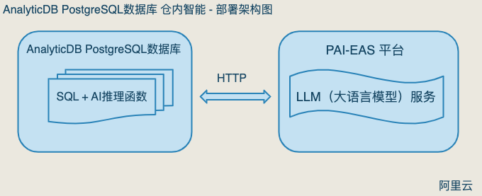
```
通过AnalyticDB PostgreSQL数据库提供的新函数：PG_CATALOG.AI_GENERATE_TEXT(...)，与部署在阿里云PAI模型在线服务（EAS）平台中的LLM（大语言模型）服务进行交互，实现对语言的推理、分类、归纳、总结。
```
## 开通 AnalyticDB PostgreSQL (ADBPG) 仓内智能
```
通过计算巢服务，一站式创建：
1. ADBPG 数据仓库实例； 
2. 在PAI-EAS平台上部署LLM（大语言）服务；
```

## 创建流程
### 1. 首先在阿里云账户 - 控制台中，找到‘计算巢’服务
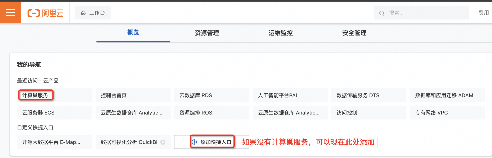
### 2. 进入计算巢服务后，点击‘服务市场’，并在搜索框中搜寻关键字‘仓内智能’，找到‘AnalyticDB PostgreSQL 仓内智能’服务，并单击进入。
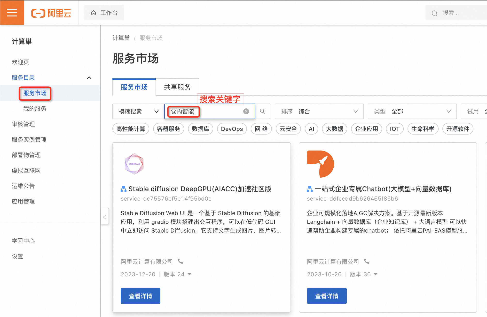
### 3. 选择 ADBPG 与 PAI-EAS 开通地域，并依次配置需要部署的大语言服务、ADBPG数据仓库的规格、VPC等相关信息。检查配置无误后，确认订单，创建服务。
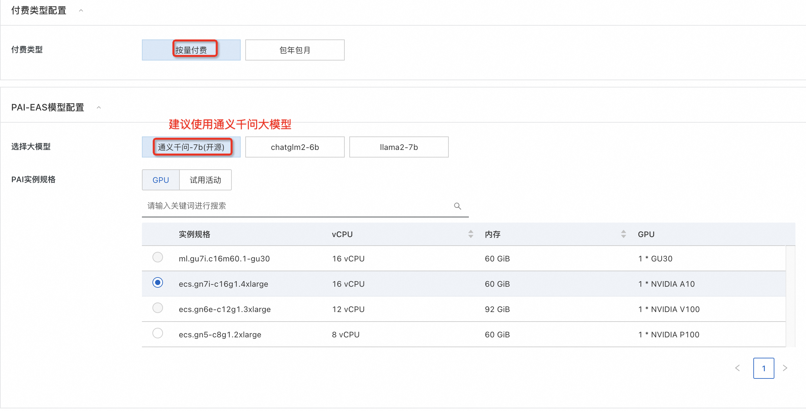
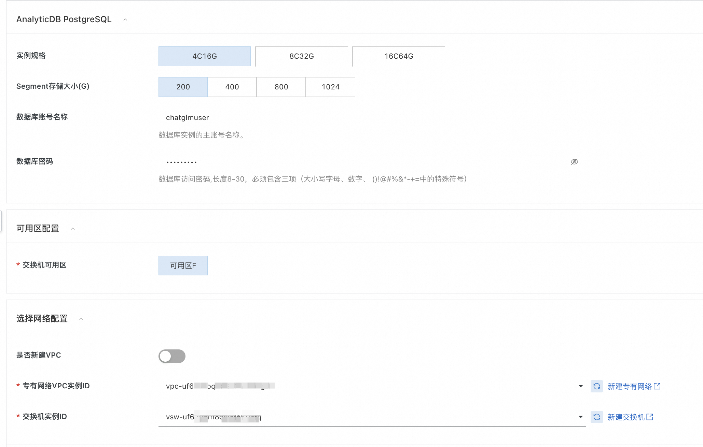
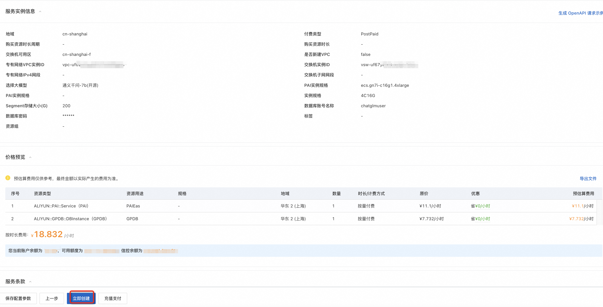
### 4. 计算巢会分别创建：ADBPG 数据仓库实例、与部署在 PAI-EAS 的大模型服务。整体时间大约20分钟左右。等待进度条变为 100%，点击进入。
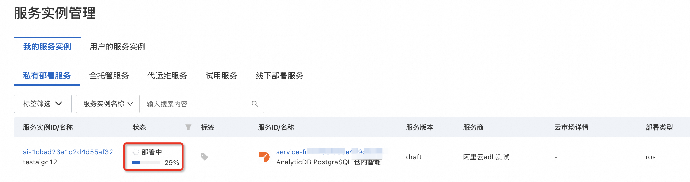
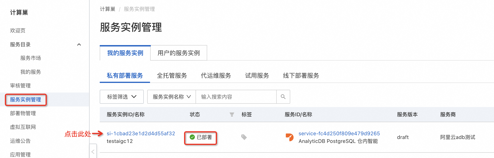
### 5. 在‘概览’中，可以查询到调用大模型服务，所用到的访问地址（Endpoint）与 Token。这两个参数非常重要。同时也可在 PAI-EAS 服务中查询到（详情见后）。
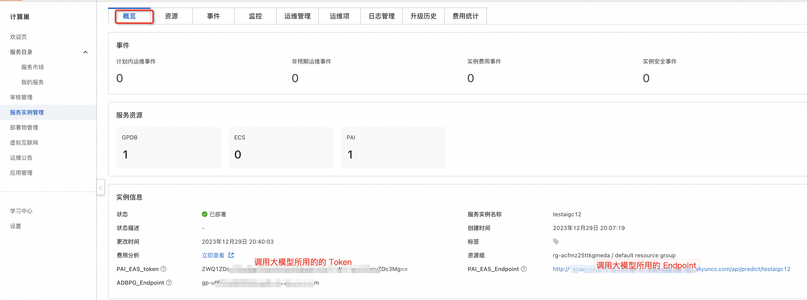
### 6. 选择‘资源’，查看部署完成的 ADBPG数据仓库实例信息、与PAI-EAS 大模型语言服务。
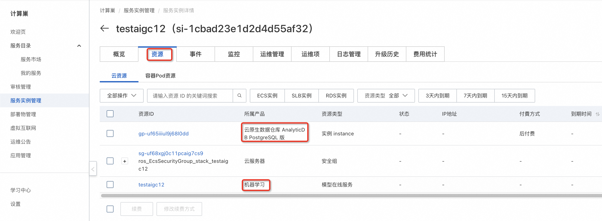
### 7. 点击步骤 #6 中的 AnalyticDB PostgreSQL，查看开通的 ADBPG数据仓库实例信息。
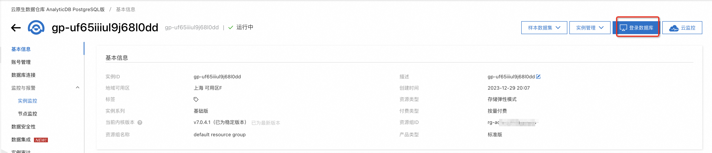
### 8. 点击步骤 #6 中的‘机器学习’服务，可以查看到PAI-EAS 大语言模型服务，对应的具体部署信息。例如：查看大语言模型的 Endpoint 与 Token。这部分信息，在后续使用‘大语言模型’服务时会用到（通过步骤#5，也可以查询到该信息）。
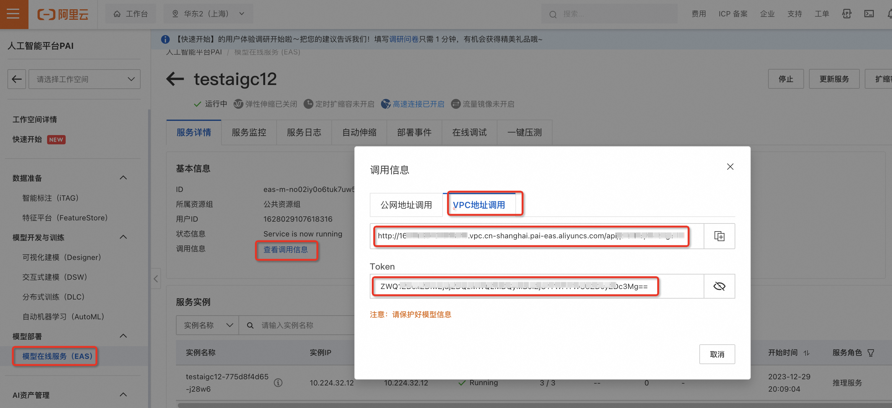
### 9. 参考以下文档，使用‘仓内智能’特性。
`https://help.aliyun.com/zh/analyticdb-for-postgresql/user-guide/aigc-warehouse-intelligence?spm=a2c4g.11186623.0.i3`
