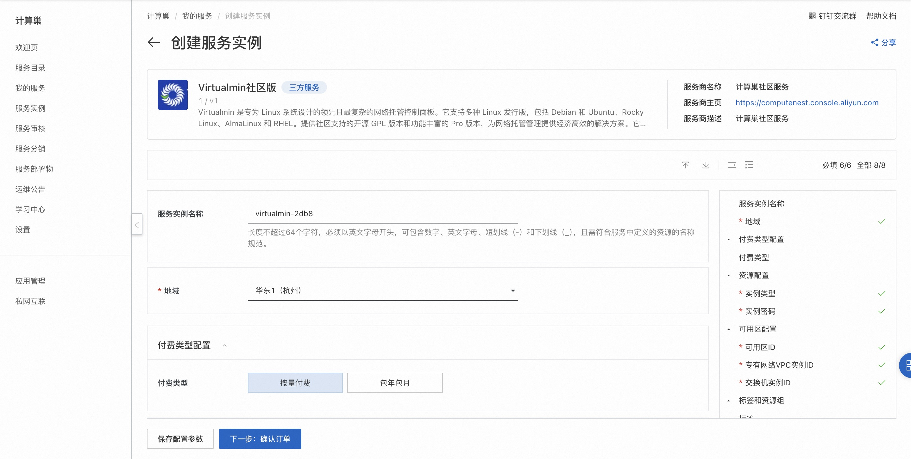
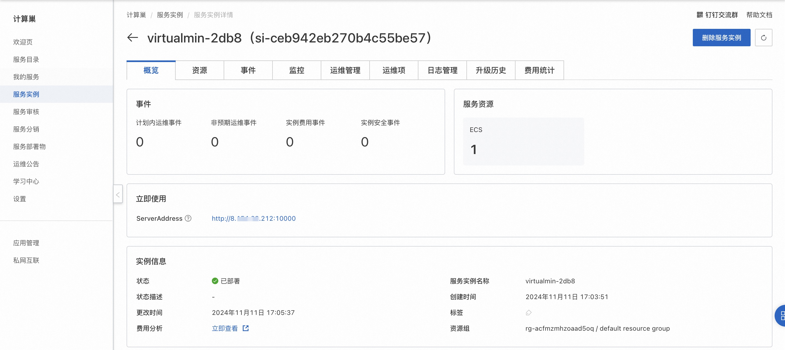
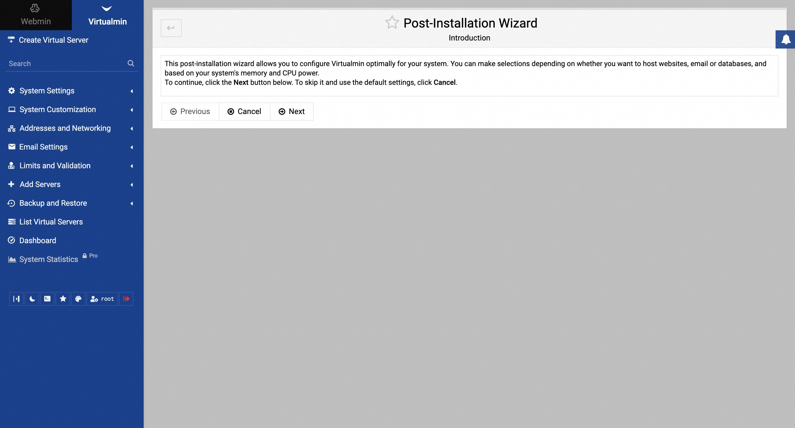

# Virtualmin 社区版快速部署

## 概述
Virtualmin 是专为 Linux 系统设计的领先且最复杂的网络托管控制面板。它支持多种 Linux 发行版，包括 Debian 和 Ubuntu、Rocky Linux、AlmaLinux 和 RHEL。提供社区支持的开源 GPL 版本和功能丰富的 Pro 版本，为网络托管管理提供经济高效的解决方案。它是网络开发人员、IT 专业人员和托管服务提供商的理想选择，可简化服务器安全更新和从 WordPress 到 Django 的 Web 应用程序的部署，以确保易用性和无缝的网站管理体验。详情请查看[Virtualmin官网](https://www.virtualmin.com/docs/)。

## 计费说明
Virtualmin社区版上的费用主要涉及：

- 所选vCPU与内存规格
- 系统盘类型及容量
- 公网带宽

## RAM账号所需权限
部署Virtualmin社区版，需要对部分阿里云资源进行访问和创建操作。因此您的账号需要包含如下资源的权限。
  **说明**：当您的账号是RAM账号时，才需要添加此权限。

| 权限策略名称                          | 备注                                 |
|---------------------------------|------------------------------------|
| AliyunECSFullAccess             | 管理云服务器服务（ECS）的权限                   |
| AliyunVPCFullAccess             | 管理专有网络（VPC）的权限                     |
| AliyunROSFullAccess             | 管理资源编排服务（ROS）的权限                   |
| AliyunComputeNestUserFullAccess | 管理计算巢服务（ComputeNest）的用户侧权限         |

## 部署流程
1. 访问Virtualmin社区版服务[部署链接](https://computenest.console.aliyun.com/service/instance/create/default?type=user&ServiceName=Virtualmin社区版)，按提示填写部署参数：
  

2. 参数填写完成后可以看到对应询价明细，确认参数后点击**下一步：确认订单**。 确认订单完成后同意服务协议并点击**立即创建**进入部署阶段。

3. 等待部署完成后进入服务实例管理, 在控制台找到Virtualmin服务访问链接。
  

4. 单击链接访问服务。
  

5. 输入服务用户名（root）和密码（创建服务实例时设置的密码）登录。
  
